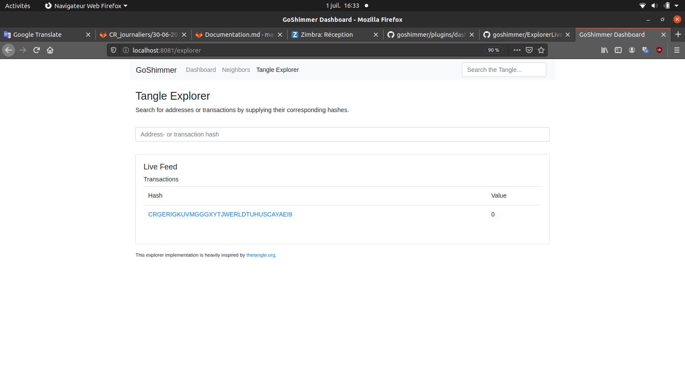

# Compte rendu journalier
***01/07/2020***
## Résumé
- J'ai trouvé comment marche l'import de librairie sur github avec go.
- J'ai fouillé dans le code source pour voir comment créer des logs des transactions.
- J'ai trouvé comment lire la base de donnée générée par GoShimmer. Si elle possède assez d'informations, je ne vais pa avoir à modifier le code source.
## Gestion des imports avec Go
J'ai trouvé comment fonctionne les imports avec Go (cf. [ce fichier](https://gitlab.imt-atlantique.fr/iota-imt/stage-ismael-collet/-/blob/master/code/ancien_client/go.mod)). Un développeur du discord iota m'a conseillé [ce tutoriel](https://docs.iota.org/docs/client-libraries/1.0/getting-started/go-quickstart).
## Client GoShimmer
Les librairies Pyota et la librairie officielle de IOTA en Go ne fonctionnent pas avec GoShimmer d'après un développeur sur discord. Mais il existe un client go pour GoShimmer : https://godoc.org/github.com/iotaledger/goshimmer/client. Cependant, il ne propose pas plus d'option que l'API web pour l'instant.
## Modification du code source
Pour avoir un log des transactions, je peux faire une modification du code source pour créer un log en live.
### Point de départ
La dernière fois, je suis parti du coomposant `dashboard` du dashboard. Cette fois, je vais partir du composant [`ExplorerLiveFeed`](https://github.com/iotaledger/goshimmer/blob/develop/plugins/dashboard/frontend/src/app/components/ExplorerLiveFeed.tsx)

Ce composant est actualisé à chaque fois que le noeud génère une transcation.
Voici son code :
```tsx
export class ExplorerLiveFeed extends React.Component<Props, any> {
    render() {
        let {msgsLiveFeed} = this.props.explorerStore;
        return (
            <Row className={"mb-3"}>
                ...
                <tbody>
                {msgsLiveFeed}
                </tbody>
                ...
            </Row>
        );
    }
}

```
### [ExplorerStore](https://github.com/iotaledger/goshimmer/blob/develop/plugins/dashboard/frontend/src/app/stores/ExplorerStore.tsx)
Cette classe possède une méthode intéressante :
```tsx
@action
    addLiveFeedMessage = (msg: MessageRef) => {
        // prevent duplicates (should be fast with only size 10)
        if (this.latest_messages.findIndex((t) => t.id == msg.id) === -1) {
            if (this.latest_messages.length >= liveFeedSize) {
                this.latest_messages.shift();
            }
            this.latest_messages.push(msg);
        }
    };
```
On pourrait ajouter à la fin de cette méthode une ligne :
```
addMessageInLogs(msg)
```
Définie dans un autre fichier , cette méthode ajouterait le message reçu dans le log

**Problème** TypeScript est un langage fait pour être lu par les navigateurs webs. Il ne peut pas écrire dans des fichiers (je crois). Il faudra donc, si on continue sur cette voie, se concentrer sur le code dans la partie backend, et étudier des fichiers commes [livefeed.go](https://github.com/iotaledger/goshimmer/blob/68fdcf49382514a2d73be0968b2e52ac86f180cf/plugins/dashboard/livefeed.go) ou [tangle/events.go](https://github.com/iotaledger/goshimmer/blob/develop/packages/binary/messagelayer/tangle/events.go).
## Lire la base de données
Grâce à l'étude du code source, j'ai [découvert](https://github.com/iotaledger/goshimmer/tree/develop/packages/database) comment est créée la base de donnée : avec [badger](https://github.com/dgraph-io/badger). Je me suis renseigné sur comment lire cette base de données. Je vais sûrement devoir utiliser un [itérateur](https://github.com/dgraph-io/badger#iterating-over-keys).
