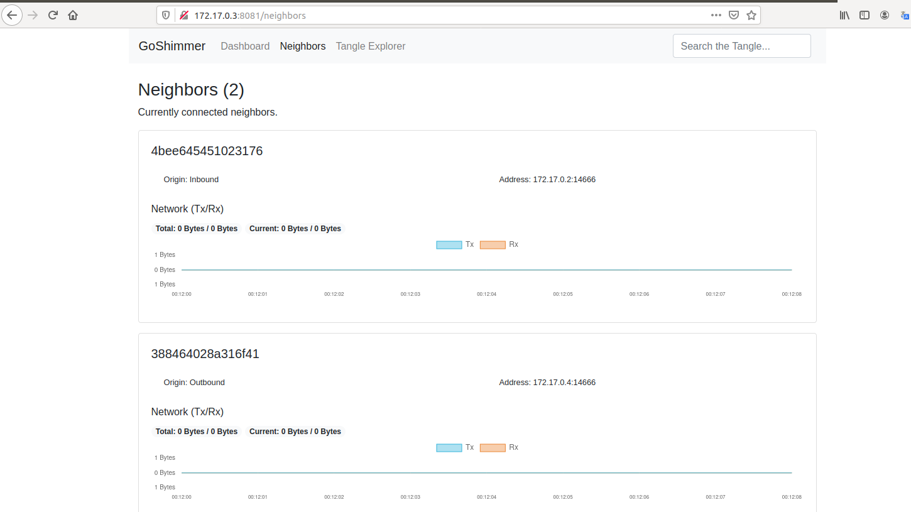
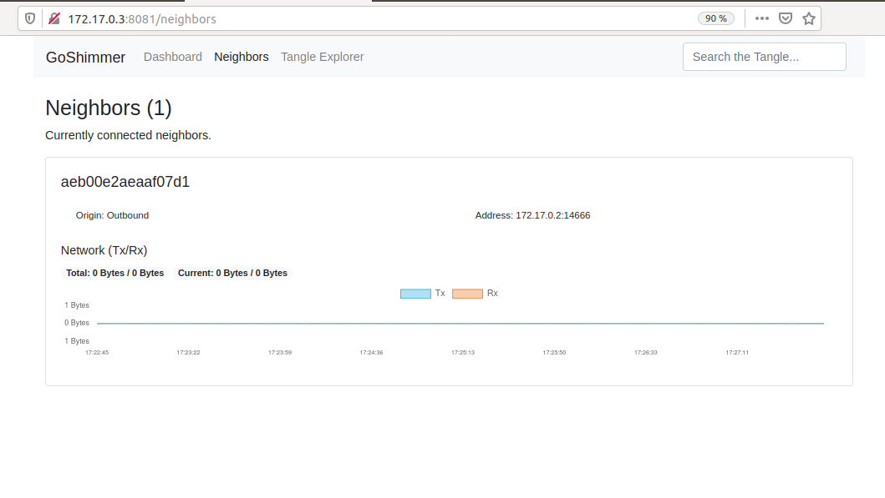

# Compte rendu journalier
***25/06/2020***

## Tests

J'ai re-testé les commandes de l'API et ai enregistré leurs outputs

## Documentation

J'ai ajouté ces parties à la documentation :

- Générer un réseau GoShimmer sur docker à la main
- Liste des commandes de l'API
- La nouvelle API

Cette dernière partie porte sur l'API associée à GoShimmer quand on le build à partir du code source.

## Automatisation

J'ai réfléchi à comment automatiser la création d'un noeud. Je vois deux solutions.

### Créer un script

 L'idée serait de lancer un noeud simplement en lançant un script shell. Le script ferait ces actions :

- Lancer un conteneur ubuntu et enregistrer son adresse ip.
- Lancer un script python (ou autre si besoin) créant un fichier de configuration. Lors du déroulement du script, l'utilisateur doit saisir le noeud d'entrée (ou laisser blanc si il veut créer un noeud d'entrée).
- Copier/Coller/Désarchiver l'archive contenant GoShimmer dans le conteneur.
- Copier/Coller la configuration dans le conteneur (dans le dossier GoShimmer).
- Lancer le noeud.
- Trouver son identité (clé publique + adresse ip) et la rendre à l'utilisateur. Pour cette partie, je vois 2 solutions :
  - Lors du lancement du noeud, enregistrer le message renvoyer et l'analyser.
  - Trouver comment obtenir la clé publique à partir de la seed. D'après les imports du fichier [autopeering.go](https://github.com/iotaledger/goshimmer/blob/develop/plugins/autopeering/autopeering.go), GoShimmer utilise l'algorithme de signature ed25519.

### Utiliser docker-compose

Cela revient à faire la même chose que l'outil disponible dans le code source. À côté de ça il faudrait un script qui renvoie la liste des noeuds et leur adresse ip pour pouvoir accéder aux dashboard des différents noeuds.

# Réseau différent par rapport à hier
Quand j'ai créé un réseau avec mes trois neuds hier, il Alice était liée à Adam et Bob. Alors que quand j'ai recréé le même réseau pour la documentation, Alice n'étais liée que à Adam. Peut-être qu'il y a une part d'aléatoire dans l'autopeering ?

Dashboard d'Alice hier :

Dashboard d'Alice aujourd'hui :
